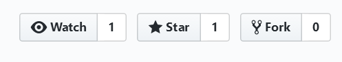
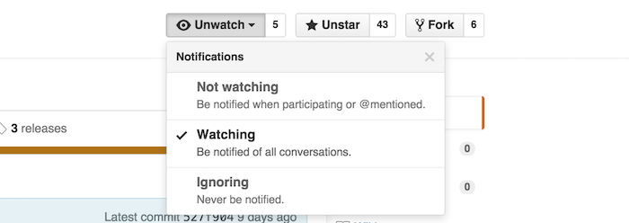
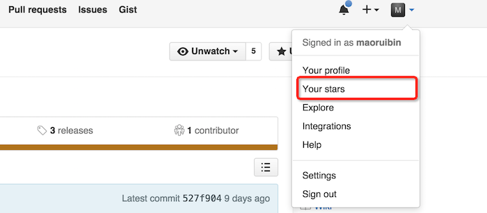
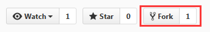

**Github中watch，star，fork的含义：**
=========================

在每个github的右上角，都有三个按钮，分别是 watch、star、fork，如下图：

下面分别介绍这三个标记的含义及使用方法：

1. watch
------------
.. image:: 2.png
watch 意为观察的意思，点击 watch 可以看到如下的列表：

对于别人的项目，默认自己都处于 Not watching 的状态，当你选择 Watching，表示你以后会关注这个项目的所有动态，这个项目以后只要发生变动，如被别人提交了 pull request、被别人发起了issue等等情况，你都会在自己的个人通知中心，收到一条通知消息，如果你设置了个人邮箱，那么你的邮箱也可能收到相应的邮件。

2. star
------------
star 意为`关注`或者`点赞`，当你点击 star，表示你喜欢这个项目，star的作用是收藏，目的是方便以后查找。
star和watch的主要区别在于前者不会把项目的动态展示在你的dashboard 里，仅作为收藏功能。

github 里面会有一个列表，专门收集了你所有 star 过的项目，点击 github 个人头像，可以看到 your stars 的条目，点击就可以查看你 star 过的所有项目了，如下图所示

3. fork
------------

GitHub中Fork 即是 服务端的仓库克隆，包含了原来的仓库（即upstream repository，上游仓库）所有内容，如分支、Tag、提交。代码托管服务（如Github、BitBucket）提供了方便的完成Fork操作的功能（在仓库页面点一下Fork按钮）。这样有了一个你自己的可以自由提交的仓库，然后可以通过的PullRequest把你的提交贡献回 原仓库。而对于原仓库Owner来说，鼓励别人Fork自己的仓库，通过PullRequest给自己的仓库做贡献，也能提高了自己仓库的知名度。

4. 使用建议
------------------
+ 对于一些可能会经常发生变化的会不定期更新的好项目 多使用 watch.需要注意的是，如果 watch多了，你可能会被无休止的邮件通知烦死（邮件通知可设置），因为被 watch 项目有任何留言、PR等更新都会触发通知，所以做好权衡。
+ 持续关注别人项目更新就star一下
+ 修改开源项目就使用 fork，这样你就可以拷贝到自己的账号下，在原项目的基础上，对项目进行修改提交。

参考资料：
::::::::::::::::

https://www.jianshu.com/p/6c366b53ea41
https://www.cnblogs.com/patchouli/p/6511251.html
